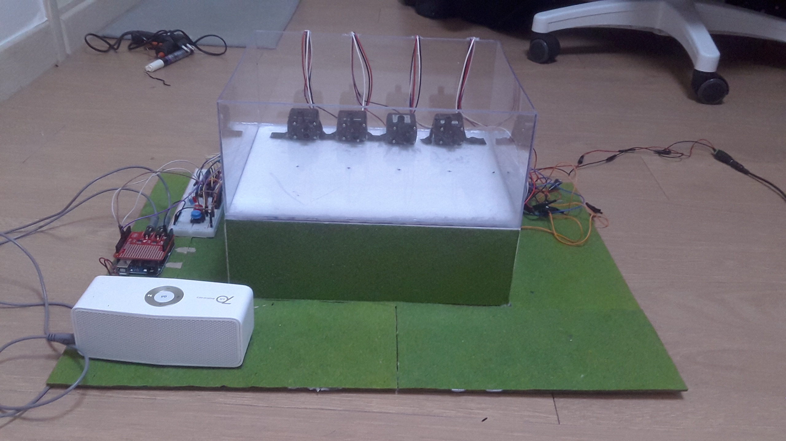
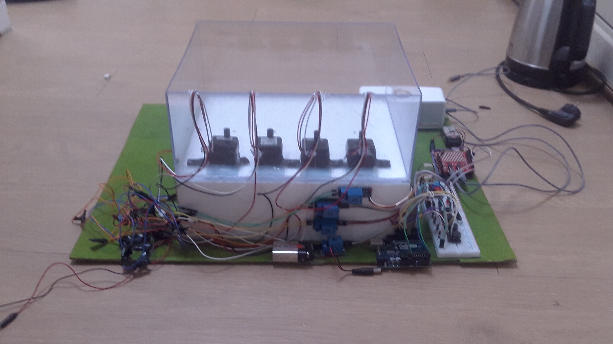
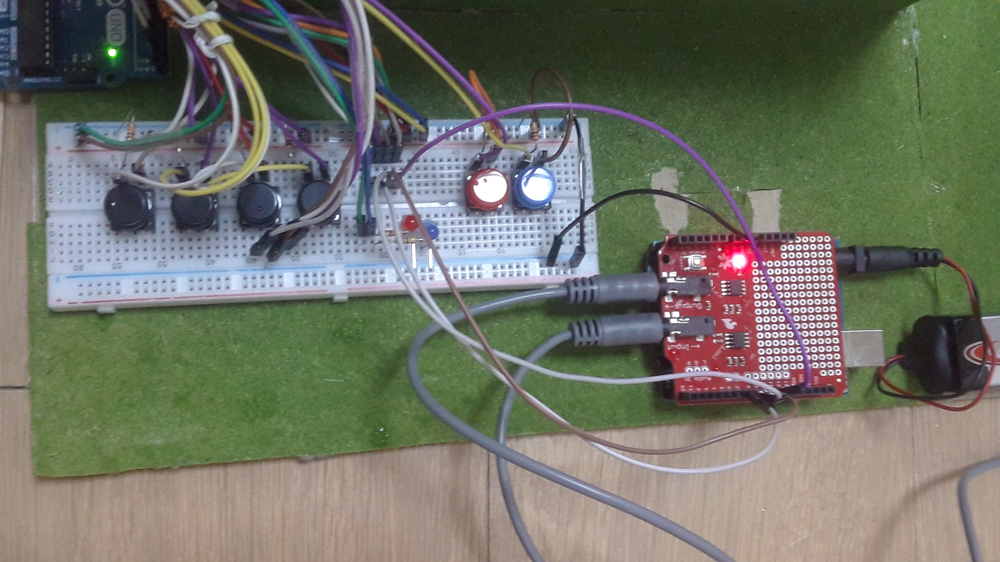
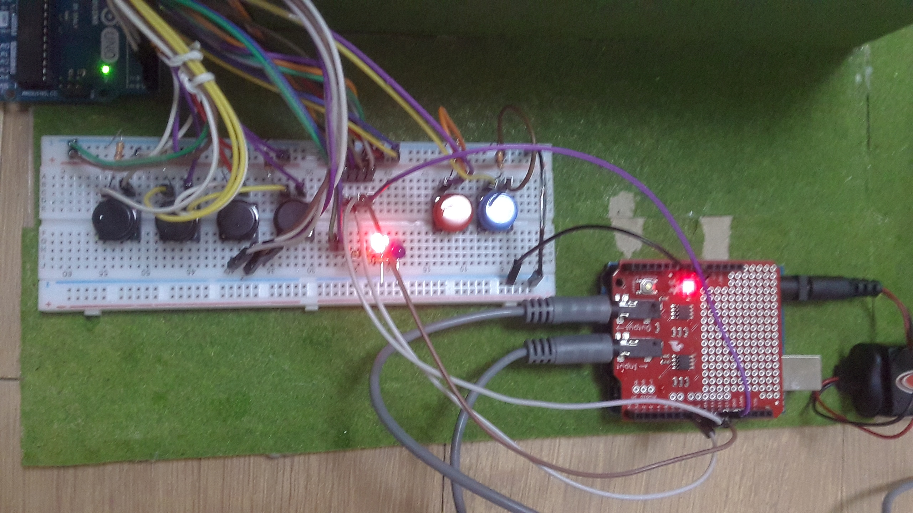
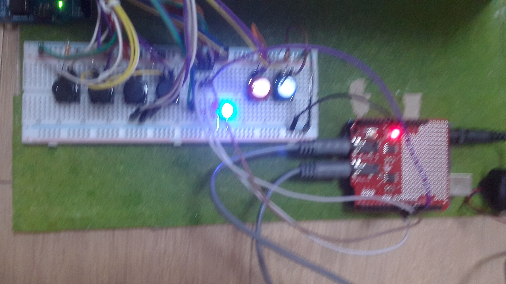
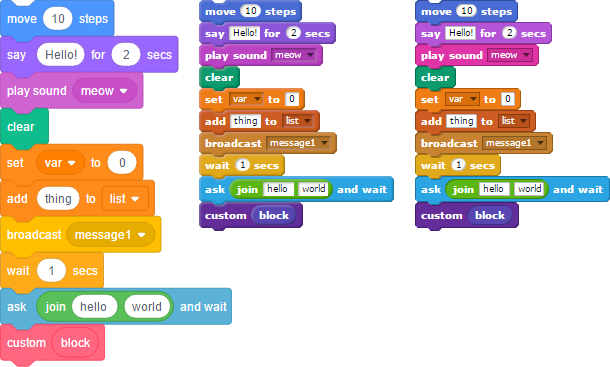
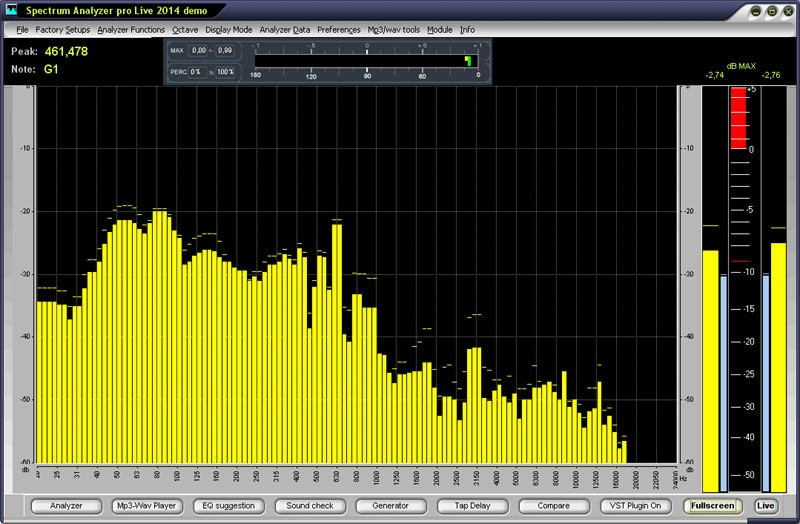

<h1>발표</h1>

<h2>1. 외형 및 기본적인 기능 소개</h2>
앞모습 

 

뒷모습 

 

컨트롤러 

 

컨트롤러 - 조작 및 녹화 모드 

 

컨트롤러 - 재생 모드 

 
 
 

<h2>2. 첫번째 기능 소개 - 프로그래밍이 가능함</h2>
우리 조의 제일 우선된 주제는 '사용자가 직접 패턴의 프로그래밍이 가능한 분수대' 였다. 

그렇다면 도대체 어떤 인터페이스를 이용해야 사용자가 직접 분수의 패턴을 프로그래밍할 수 있을까? 
이것이 이번 프로젝트의 가장 큰 고민 중 하나였다.
 
이 고민에 대한 해결책으로써 제일 먼저 들었던 생각은 바로 '블록'을 이용한 것이었다.

 그러나 이 아이디어는 굉장히 구현하기 어렵다는 것을 몇차례의 시도 후 곧바로 알게 되었다.

 그리고 나서 계속하여 고민을 하다가, 마침내 다음과 같은 아이디어가 떠올랐다.
 
 만약 4개의 워터펌프를 각각의 버튼으로 on off 제어가 가능하다면, 그냥 그 on off 기록을 녹화한 다음에 다시 반복적으로 재생하는 기능만 구현해주면 사용자가 직접 분수의 패턴을 간단하게 프로그래밍할 수 있게 되지 않을까?

 이러한 아이디어를 이후 조사해보니, 다행히도 "Arduino Record and Play"라는 키워드로 검색하면 웹상에서의 자료가 어느정도 나왔다. 그리고 몇번의 시도 후에 실제 구현을 완료할 수 있게 되었다.

(프로그래밍 가능한 분수대 완성 모습↓)
 
 
(이미지 클릭하면 동영상 링크로 이동.)
  
이 기능의 구현을 위해서는, 녹화모드 동안 총 네가지 종류의 변수가 기록된다.
<ol>
  <li>어떤 워터펌프가 켜져있는지</li>
  <li>그 워터펌프가 얼마나 오래 켜져있는지</li>
  <li>어떤 워터펌프가 꺼져있는지</li>
  <li>그 워터펌프가 얼마나 오래 꺼져있었는지</li>
</ol>

그리고 재생모드일 때는, 저 네가지 종류의 변수를 그대로 되풀이하며 반복적으로 재생하게 된다. 
더 자세한 내용은 코드에서 설명하도록 하기로 한다.

(시연 - 버튼 한개, 파도타기, 버튼 동시에 입력, 계속 출력하게 하기)
 

<h2>3. 두번째 기능 소개 - 음악 반응</h3>

또다른 기능도 구현하고 싶었다. 
사용자가 굳이 패턴을 직접 프로그래밍 할 필요 없이, 사용자가 좋아하는 노래를 입력해주기만 하면, 그 노래에 맞춰 자동으로 반응을 하는 분수대를 만드는 것도 좋을 것 같았다. 
그렇다면 이를 어떤 형태로 구현하면 좋을까를 고민해보니, 다음과 같은 아이디어가 떠올랐다.

  
분수대가 총 네개의 워터펌프로 이루어져 있으니, 미디어 플레이어같은 프로그램에서 자주 등장하는 오디오 스펙트럼과 같이, 워터 펌프 하나당 오디오 스펙트럼 기둥 하나를 담당하게 하면 좋을 것 같다는 생각이 들었다.

(음악 반응 분수대 완성 모습↓)
 
 
(이미지 클릭하면 동영상 링크로 이동.)
  이 기능의 구체적인 구현 방법은 이후 하드웨어 및 회로 설명, 코드 설명에서 설명하기로 한다.

(시연 - 주파수 반응, 노래 반응)

<h2>4. 주요 하드웨어 요소 및 회로 설명</h2>

회로 그려서 올리기

아답터와 릴레이 설명

스펙트럼 분석 모듈 이미지 올리기

<h2>5. 코드 설명</h2>

1. 녹화 원리 설명(펌프 하나만 가지고서)

2. 스펙트럼 분석 과정 그림가지고 설명.

그리고 스펙트럼 대역 묶어서 워터펌프 하나에 연결시킨 것 설명

<h2>6. 맞닥뜨리게 된 문제들, 그리고 그로부터 배운 것들</h2>
